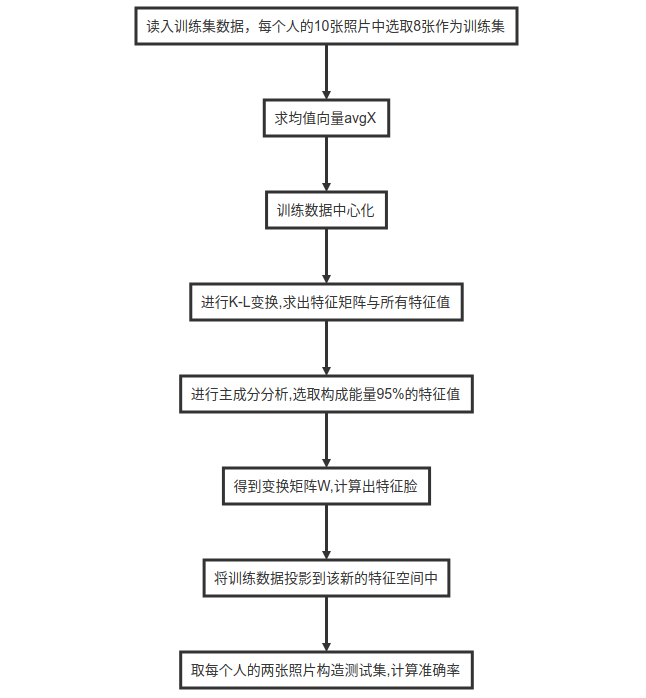
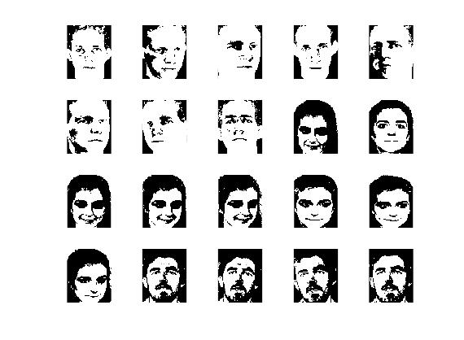
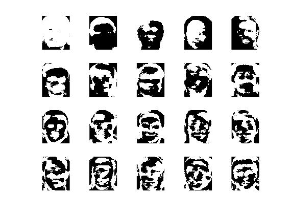
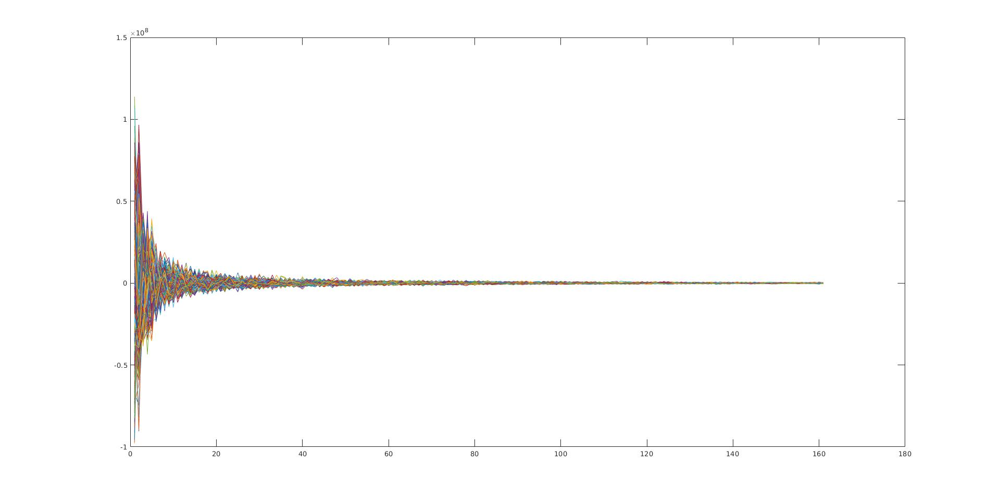
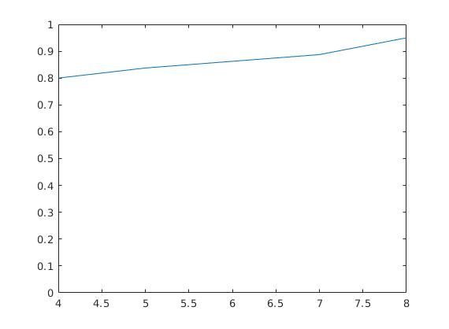

由于 Github 的 markdown 不支持 LaTeX 公式和流程图, README.md的公式格式化出来都是乱的. 报告的PDF版已上传.

[TOC]

# 应用K-L变换在OCL库中进行人脸识别

## 一. 原理简述与程序框图

### 1. 原理

#### 1.1 K-L变换

> K-L变换也常称为主成分变换(PCA)，是一种基于图像统计特性的变换，它的协方差矩阵除对角线以外的元素都是零(所以大家也叫它最佳变换)，消除了数据之间的相关性，从而在信息压缩方面起着重要作用。

在模式识别和图像处理中一个主要的问题就是降维，在实际的模式识别问题中，我们选择的特征经常彼此相关，在识别这些特征时，数量很多，大部分都是无用的。如果我们能减少特征的数量，即减少特征空间的维数，那么我们将以更少的存储和计算复杂度获得更好的准确性。如何寻找一种合理的综合性方法，使得：

1. 减少特征量的个数。
2. 尽量不损失或者稍损失原特征中所包含的信息。
3. 使得原本相关的特征转化为彼此不相关(用相关系数阵衡量)。

**K-L变换**即主成分分析就可以简化大维数的数据集合。K-L 变换以原始数据的**协方差矩阵的归一化正交特征矢量构成的正交矩阵**作为变换矩阵,对原始数据进行正交变换,在变换域上实现数据压缩。它具有去相关性、能量集中等特性,属于均方误差测度下,失真最小的一种变换,是最能去除原始数据之间相关性的一种变换。它还可以用于许多图像的处理应用中，例如：压缩、分类、特征选择等。

K-L变换的实质就是去除各维度之间的相关性。就是建立新的坐标系，将原本高度相关的数据在新坐标系下的协方差矩阵除对角线以外的元素都是零。从坐标系的角度来看，图像的矩阵可以看作为二维平面上一组像素点坐标的集合，变换你结果Y可以看作是图像矩阵X在一个新的坐标系下的相同像素点的集合。该新的坐标系为原坐标系的旋转，旋转矩阵即为K-L变换矩阵。

> 在原坐标系下的x和y具有非常强的相关性，而变换后两者之间的相关性被去除。

K-L变换的目的，即在于找出使得X矢量中的各个分量相关性降低或去除的方向，对图像进行旋转，使其在新空间的坐标轴指向各个主分量方向——主成分分析或者主成分变换。扩展至多维空间，K-L变换可实现多维空间中的去相关，并将能量集中在少数主分量上。

构建新坐标系的过程就是主成分变换的过程。y代表新坐标系的坐标点，x代表原来坐标系的点。
$$
y=W * x
$$
其中$W$就是变换矩阵, $W$矩阵就是$x$的协方差矩阵的特征向量矩阵的转置矩阵。

#### 1.2 主成分选取

PCA 则是选取协方差矩阵前 k 个最大的特征值的特征向量构成 K-L 变换矩阵。保留多少个主成分取决于保留部分的累积方差在方差总和中所占百分比（即累计贡献率），它标志着前几个主成分概括信息之多寡。实践中,粗略规定一个百分比便可决定保留几个主成分;如果多留一个主成分,累积方差增加无几,便不再多留。

#### 1.3 人脸空间的建立

假设一幅人脸图像包含 $N$ 个像素点,它可以用一个 $N$ 维向量$x$表示,这样,训练样本库就可以使用$x_i(i=1,...,M)$来表示.协方差矩阵$C$的正交特征向量就是组成人脸空间的基向量,即特征脸. 将特征值由小到大排列: $\lambda_{1} \geqslant \lambda_{2} \geqslant \ldots \geqslant \lambda_{\mathrm{r}}$, 其对应的特征向量为$\mu_{\mathrm{k}}$.这样每一幅人脸图像对应于子空间中的一点。同样,子空间的任意一点也对应于一幅图像.

#### 1.4 人脸识别

有了这样一个由"特征脸"张成的降维子空间,任何一幅人脸图像都可以向其投影得到一组坐标系数,这组系数表明了该图像在子空间中的位置,从而可以作为人脸识别的依据。

1. 计算数据库中每张图片在子空间中的坐标,得到一组坐标,作为下一步识别匹配的搜索空间。

2. 计算新输入图片在子空间中的坐标,采用最小距离法,遍历搜索空间,得到与其距离最小的坐标向量,该向量对应的人脸图像即为识别匹配的结果。

### 2. 实验步骤

1. 选取数据集，并将其读入．将每一张图像均reshape为列向量$X_i$,并组合成数据矩阵.
   $$
   \mathbf{X}=\left(\mathbf{X}_{1}, \mathbf{X}_{2}, \ldots, \mathbf{X}_{n}\right)
   $$

2. 求均值向量
   $$
   \boldsymbol{\mu}=\frac{1}{n} \sum_{i}^{n} \boldsymbol{X}_{i}
   $$

3. 求中心化后的数据矩阵
   $$
   \mathrm{C}=\left(\mathbf{X}_{1}-\boldsymbol{\mu}, \mathbf{X}_{2}-\boldsymbol{\mu}, \ldots, \mathbf{X}_{n}-\boldsymbol{\mu}\right)
   $$

4. 求$C^{\top} \mathrm{C}$的协方差矩阵的特征值, 选取出$k$个使得它的总能量达到设定值, 求出特征脸(特征向量)$\mathbf{e}_{\mathbf{i}}$, 将$k$个这样的向量按列排列成变换矩阵$W$
   $$
   W=\left(\mathbf{e}_{1}, \mathbf{e}_{2}, \ldots, \mathbf{e}_{k}\right)
   $$

5. 计算每一幅图像的投影($k$维列向量)
   $$
   Y_{i}=W^{\top}\left(X_{i}-\mu\right)
   $$

6. 计算待识别的人脸的投影(k维列向量), 设待识别的人脸为$Z$
   $$
   \operatorname{ch} \mathbf{Z}=\mathbf{W}^{\top}(\mathbf{Z}-\boldsymbol{\mu})
   $$

7. 遍历搜索进行匹配,找到最近邻的人脸图像,根据标签得到$Z$属于第几个人.
   $$
   Y_{j}=\min | | Y_{i}-\operatorname{ch} z| |
   $$

### 3. 程序框图



## 二. 实验结果分析

### 1. 训练数据中心化样例

Fig.1.2.1训练数据中心化后的图片.



这里展示其中20张训练数据中心化后的人脸样例.

### 2. 计算出的特征脸样例

Fig.1.2.2 特征脸样例



这里展示其中20张特征脸样例. 


### 3. 训练数据投影到新的特征空间

Fig.1.2.3 训练数据投影到新的特征空间后的数据分布图



​	训练数据投影到新的特征空间后对应的新的数据矩阵,横轴表示维度(选取的主分量的数量),纵轴代表投影后的各个分量的大小,可以看出靠前的分量占得总能量更大.

### 4. 训练数据的数量对测试分类精确度的影响

我们的训练数据集中一共有40个人的照片,每个人的照片各十张.我们将每个人的后两张图片作为测试样本集.然后根据前面通过改变训练样本的数量来观察其对分类精确度的影响.我们通过改变每个人选取的照片数量$n$来控制训练数据集的大小.我们分别取了$n=3,4,...,8$,绘制出了其精确度变化的曲线.

Fig.1.2.4 模型的精确度随训练数据集的数量的变化.



可见,随着训练样本数的增加,模型的精确度也在上升,其中当每个人的照片至少取4张时才可以开始进行比较好的判别.

## 三. 程序代码

matlab程序代码:

```matlab
clear
close all;
clc

% 按文件夹读取数据,数据保存到allData中
db = dir('orl_faces');
face = cell(1, 1); 
allData = zeros(2, 2);
labelList = zeros(1, 1);

acc_index = 0;
for train_data_nums = 6:-1:2
    num = 0;
    type = 0;
    labelMap = containers.Map(0,0);
    for i = 4 : length(db)
        fi = dir([db(i).folder '/' db(i).name]);
        type = type + 1;
        for j = 3 : length(fi)-train_data_nums
            num = num + 1;
            face{i - 2, j - 2} = imread([fi(j).folder '/' fi(j).name]);
            labelMap(num) = type;
            if num == 1
                [imageLen, imageWid] = size(face{i - 2, j - 2});
            end
            allData(1: imageLen * imageWid, num) = double(reshape(face{i - 2, j - 2}, [imageLen * imageWid, 1]));
            % imshow(face{i - 2, j - 2});
        end
        labelList(1, type) = i-3;
    end

    % 求均值向量
    [allDataRows, allDataCols] = size(allData);
    % avgX = 1.0/allDataCols * sum(allData, 2);

    avgX = mean(allData, 2);
    % plot(avgX);
    % imshow(reshape(avgX, [imageLen, imageWid]));

    for num = 1:allDataCols
        allData(:, num) = allData(:, num)-avgX;
    end

    % for num = 1:20
    %     subplot(4, 5, num);imshow(reshape(allData(:, num), [imageLen, imageWid]));
    % end

    % 求协方差矩阵
    % covC = 1.0/allDataCols * C * C';
    covC = allData' * allData;

    % covC = cov(allData);
    [coeffC, latentC, explainedC] = pcacov(covC);

    % 选取构成能量95%的特征值
    numOfLatent = 1;
    proportion = 0;
    while(proportion < 95)
        proportion = proportion + explainedC(numOfLatent);
        numOfLatent = numOfLatent+1;
    end
    numOfLatent = numOfLatent - 1;

    % 求特征脸
    W = allData*coeffC;
    W = W(:, 1:numOfLatent);
    % plot(W(:), 1);

    % for k = 1:20
    %     subplot(4, 5, k);imshow(reshape(W(:, k), [imageLen, imageWid]));
    % end

    % 将训练数据投影到该新的特征空间中
    reference = W' * allData;
    % plot(reference);

    % 测试训练结果准确率
    distances = zeros(1, 1);
    testNum = 0;MNIST 数据集来自美国国家标准与技术研究所, National Institute of Standards and Technology (NIST). 训练集 (training set) 由来自 250 个不同人手写的数字构成, 其中 50% 是高中学生, 50% 来自人口普查局 (the Census Bureau) 的工作人员. 测试集(test set) 也是同样比例的手写数字数据.
    type_index = 0;
    accCnt = 0;
    for i = 4 : length(db)
        fi = dir([db(i).folder '/' db(i).name]);
        type_index = type_index + 1;
        for j = length(fi)-1 : length(fi)
            testNum = testNum + 1;
            imgTest = imread([fi(j).folder '/' fi(j).name]);
            imgTest = reshape(imgTest, [imageLen * imageWid, 1]);
            imgTest = double(imgTest(:));
            imgTest = W' * (imgTest - avgX);

            dis = realmax('double');
            for k = 1:allDataCols
                temp = norm(imgTest - reference(:, k));
                distances(:, k) = norm(imgTest - reference(:, k));
                if(dis > temp)
                    aimOne = k;
                    dis = temp;
                end
            end

            if labelMap(aimOne) == type_index
                accCnt = accCnt + 1;
            end
        end
    end

    % plot(distances);
    acc_index = acc_index + 1;
    accuray(acc_index+3) = accCnt/testNum;
end

% plot(accuray);
```

